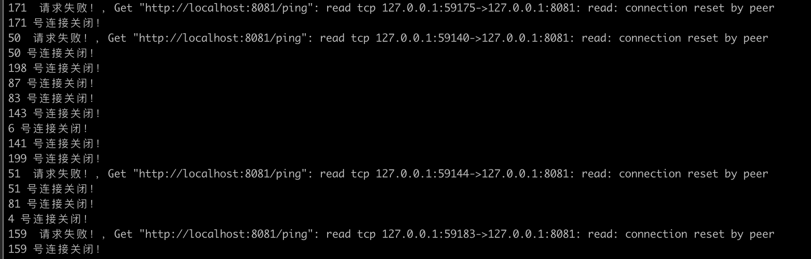
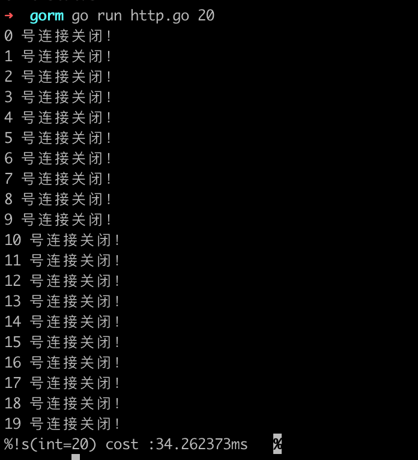

# 问题记录

## problem_1
### 问题1
`go_http.go`

```go

func main() {

	NUM, _ = strconv.Atoi(os.Args[1])
	waitgroup := sync.WaitGroup{}
	start := time.Now()

	for i := 0; i < NUM; i++ {
        // 这里使用 go routine NUM > 100  大概率就会出现
        // Get "http://localhost:8081/ping": read tcp 127.0.0.1:59175->127.0.0.1:8081: read: connection reset by peer
		go qingqiu(i, &waitgroup)
	}
	cost := time.Since(start)
	waitgroup.Wait()
	fmt.Printf("%s cost :%s\t", NUM, cost)
}
```
---
当并发数量在100以上时候大概率出现这个问题，我查资料说的是，其中一方先关闭了连接导致的。但是我也不知道是 C\S 端的问题。以及该怎么排查和解决。


---
只要在请求时候不用 goroutine， 换成顺序执行的结构不论多少请求都没有问题.




### 问题2
`ab`
* ab 命令如何实现并发连接数量测试
